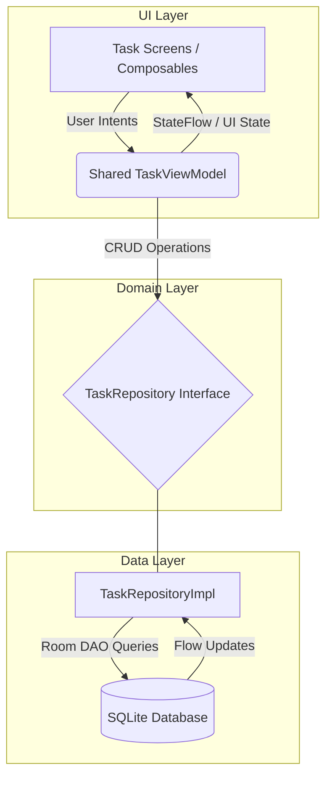

# TaskHub

TaskHub is a modern, lightweight Android task management application built entirely with Jetpack Compose. This project focuses on demonstrating modern Android architecture, robust state management, and high-performance, modular UI design.

> **Note:** This project is intentionally built as a showcase for architectural best practices, clean design, and efficient resource usage in a modern Android ecosystem.

---

## 🛠 Tech Stack
* **Language:** Kotlin
* **UI Framework:** Jetpack Compose (Material Design 3)
* **Navigation:** Navigation Compose
* **Local Persistence:** Room Database (with Kotlin Symbol Processing - KSP)
* **Asynchrony:** Kotlin Coroutines, `StateFlow`, `SharedFlow`
* **Architecture:** MVVM with Clean Code principles

---

## 🏗 Architecture & Best Practices

### System Architecture Diagram


### 1. Shared ViewModel Strategy
To ensure a Single Source of Truth and seamless data synchronization across different screens, TaskHub utilizes a **Shared ViewModel**. 
Instead of instantiating multiple ViewModels for tightly coupled screens (like a list screen and a detail screen), the shared ViewModel is scoped to the navigation graph. It guarantees that when a task is updated on one screen, the change is immediately reflected on all other screens without needing complex callbacks or extra database reads.

### 2. Local Data Persistence (Room)
The application utilizes a fully reactive local database architecture powered by Room and Kotlin Flows.
* **Reactive UI:** The ViewModel observes a continuous `StateFlow` from the `TaskRepository`. Inserts, updates, or deletions made to the database instantly trigger a reactive emission, updating the UI without manual state manipulation.
* **Clean Architecture:** Database entities and DAOs are isolated in the `data.local` layer. The UI only communicates with the domain Repository interface, ensuring strict separation of concerns.
* **Custom Type Converters:** Complex types (like Priority enums) are seamlessly mapped to SQLite primitives via Room `@TypeConverters`, keeping the database schemas clean and standard.

### 3. State Hoisting
Adheres strictly to the concept of **State Hoisting** to make UI components stateless and highly reusable.
Data flows down, and events flow up. Composables are not responsible for managing their own complex business state. State variables and lambda callbacks are passed down from the parent screen-level Composable. This renders individual UI components highly testable and fully decoupled from the ViewModel layer.

### 4. UI Component Breakdown (Modular UI)
To optimize rendering performance and prevent unnecessary recompositions, the UI is heavily modularized.
* **Granular Components:** Complex screens are broken down into smaller, focused Composables (e.g., `TaskListItem`, `EmptyStateView`, `CustomTopAppBar`).
* **Flat Layouts:** Avoids deep nesting of `Column`s and `Row`s wherever possible, ensuring a shallow and performant View hierarchy.

*By keeping components small, Jetpack Compose intelligently skips recomposing elements that remain unchanged.*

### 5. Naming Conventions
A consistent naming convention is maintained for the scannability of the codebase.
* **Composables:** Utilizes PascalCase and noun-phrases (e.g., `TaskListScreen`, `SaveButton`).
* **Variables/Functions:** Utilizes camelCase (e.g., `onTaskClick`, `taskTitle`).
* **State/Flows:** Backing properties are prefixed with an underscore (e.g., `_uiState` as a `MutableStateFlow` and `uiState` as an immutable `StateFlow` exposed to the UI).

### 6. Clean Code & SOLID Principles
Code readability and maintainability are prioritized over complex, condensed logic.
* **Separation of Concerns:** The UI is strictly stateless and passive; all business logic, validation, and data formatting execute in the ViewModel or Domain layer.
* **Self-Documenting:** Functions and variables are named descriptively, allowing the code to read naturally without requiring excessive, redundant comments.
* **Resource Discipline:** Coroutines are properly scoped to the `viewModelScope` to prevent memory leaks, and Room streams are safely collected in a lifecycle-aware manner using `collectAsStateWithLifecycle()`.

---

## 🚀 Getting Started

To clone and run this project locally, ensure you have the following installed:
* **Android Studio** (Ladybug or newer recommended)
* **JDK 17+**

### Installation Steps:
1. Clone the repository:
   ```bash
   git clone https://github.com/abdallamusa103-ops/TaskHub.git
   ```
2. Open the project in **Android Studio**.
3. Sync the project with Gradle files.
4. Build and run on an emulator or physical device.


